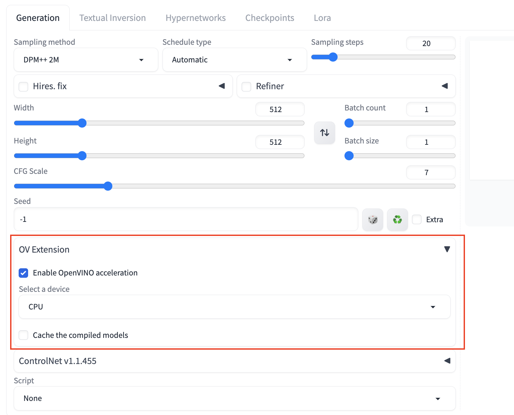
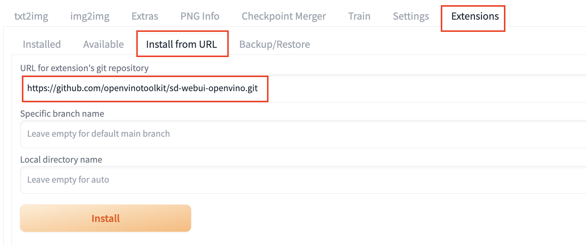
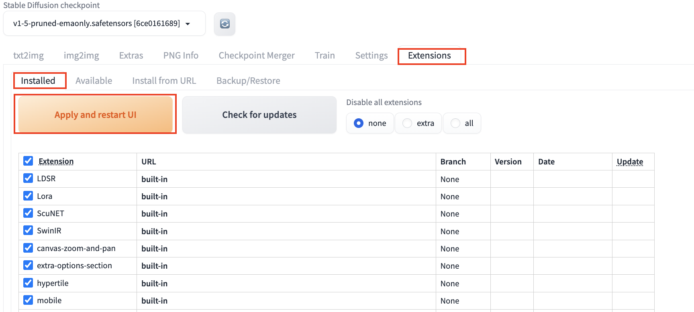

# THIS PROJECT IS ARCHIVED   
Intel will not provide or guarantee development of or support for this project, including but not limited to, maintenance, bug fixes, new releases or updates.  
Patches to this project are no longer accepted by Intel.  
 If you have an ongoing need to use this project, are interested in independently developing it, or would like to maintain patches for the community, please create your own fork of the project.  
  
# OpenVINO Extension for Stable Diffusion

This extension accelerate the image generation speed by integrating OpenVINO backend to diffusers.

## Installation
- Open "Extensions" tab.
- Open "Install from URL" tab in the tab.
Enter https://github.com/openvinotoolkit/sd-webui-openvino.git to "URL for extension's git repository".

- Press "Install" button.
- Go to "Installed" tab, then click "Apply and restart UI". 

## Features
- Support txt2img pipeline, img2img, and inpaint pipeline. 
- Support most of the upscalers, fallback to torch for unsupported upscalers.
  - OpenVINO supported model get accelerated automatically(latent, R-esrGAN, etc)
  - OpenVINO yet to support model fallback to native Pytorch
- Support ControlNet 1.0/1.1 throught [ControlNet Extension](https://github.com/Mikubill/sd-webui-controlnet)
- Support Lora

